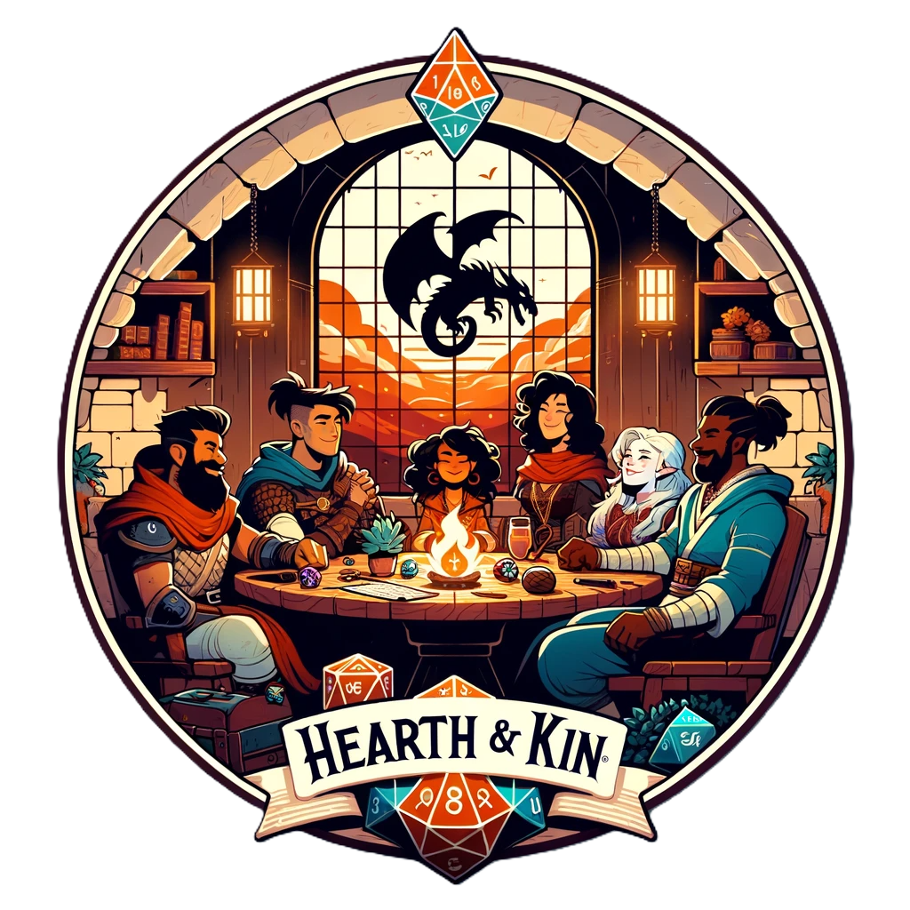

# Hearth and Kin
[](https://github.com/kodackx/hearth_and_kin/actions/workflows/build.yml)


Welcome to Hearth and Kin, an innovative experiment in collaborative storytelling. Harnessing the power of generative AI models for speech, text, and visuals, we craft a dynamic narrative experience inspired by the rich tradition of role-playing tabletop games.

In Hearth and Kin, you have the freedom to create the characters you envision, building intricate backstories that bring them to life. Once your character is ready, embark on thrilling adventures and craft captivating stories. Invite your friends to join these adventures and experience the magic of shared storytelling.

Discover a new realm of creativity and connection with Hearth and Kin, where your imagination sets the stage and your stories know no bounds.

## Libraries and APIs Used

- FastAPI: A modern, fast (high-performance), web framework for building APIs with Python 3.6+ based on standard Python type hints.
- SQLModel: SQL databases in Python, designed for simplicity, compatibility, and robustness.
- OpenAI: An API for accessing OpenAI's artificial intelligence models.
- nVidia NIM: A library for working with NVIDIA's AI models and tools.
- Elevenlabs: A text-to-speech API for generating high-quality voice outputs.
- Dall-E3: An API for generating images from textual descriptions using OpenAI's DALL-E model.
- Uvicorn: A lightning-fast ASGI server implementation, using uvloop and httptools.
- websockets: A library for building WebSocket servers and clients in Python (multiplayer)

## Code Structure

Our project is organized as follows:

- **FastAPI Endpoints**: We use FastAPI to create and manage our API endpoints, ensuring high performance and ease of use.
- **SQLModel for Database**: SQLModel is utilized for building and interacting with our database, providing a simple and robust ORM.
- **Frontend**: A simple HTML/JavaScript frontend is used to interact with our API and display data to the user.
- **Uvicorn**: Uvicorn is used as the ASGI server to run our FastAPI application.
- **Websockets**: Websockets are implemented for real-time communication between the client and server.
- **Testing**: Pytest is used for writing and running our test cases to ensure code quality and reliability.

## Environment Variables

The application uses the following environment variables (expected in a `.env` file in the project root folder):
- OPENAI_API_KEY: The API key for OpenAI.
- ELEVENLABS_API_KEY: The API key for ElevenLabs.
- ELEVENLABS_VOICE_ID: The voice ID for ElevenLabs.
- NVIDIA_API_KEY: API Key for nVidia hosted models.

Look at `.envexample` file to build your `.env` file following the same structure.

## Development/How to run the app

Install [pyenv](https://github.com/pyenv/pyenv). When you enter the directory, it will recognize which python version should be used (`.python-version file`) and use it automatically.


```bash
cd hearth_and_kin
pyenv install $(cat .python-version)
```

Connect poetry to the proper version of python

```bash
poetry env use $(which python)
```

Install dependencies locally

```bash
make install
```

Run tests (pytest)

```bash
make test
```

Build app

```bash
make build
```

Run app

```bash
make run
```